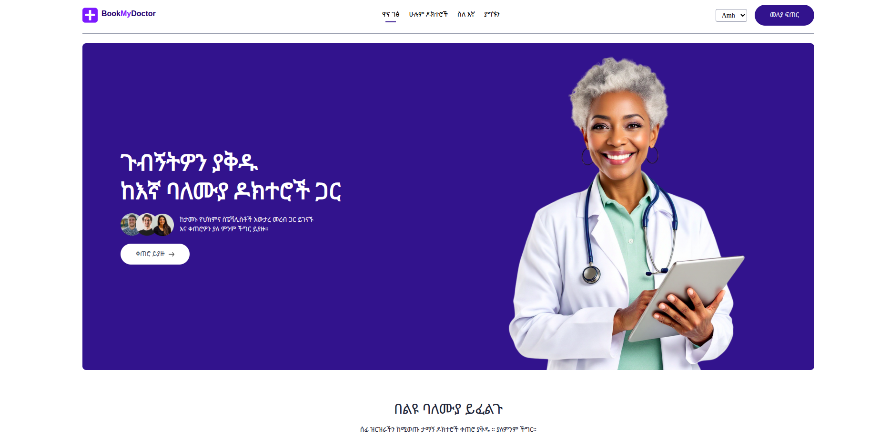

# BookMyDoctor – Hospital Appointment System

A premium, production-ready full-stack MERN platform for managing medical appointments. Built with an elegant, modern healthcare-themed design and robust backend infrastructure.



## Key Pillars

- **Patient-Centric**: Seamless doctor discovery, intuitive booking, and profile management.
- **Admin-Powered**: Centralized control over doctors, appointments, and system metrics.
- **Global Ready**: Fully localized support for English and Amharic.
- **Production-Grade**: Containerized with Docker, secured with JWT and Redis, and optimized for deployment.

## Quick Navigation

- **[QUICK_START.md](QUICK_START.md)** — Get running in 5 minutes.

---

##  Project Modules

| Module | Description | Setup |
| :--- | :--- | :--- |
| **Backend** | Node.js/Express API with MongoDB & Redis | [View Details](backend/README.md) |
| **Frontend** | Patient application (React + Vite) | [View Details](frontend/README.md) |
| **Admin** | Manager Dashboard (React + Vite) | [View Details](admin/README.md) |

---

##  Quick Start (Docker)

The fastest way to experience BookMyDoctor is via Docker Compose:

```bash
docker compose up --build -d
```

- **Frontend (Patient):** [http://localhost:5173](http://localhost:5173)
- **Admin Dashboard:** [http://localhost:5174](http://localhost:5174)
- **API Server:** [http://localhost:4000](http://localhost:4000)

---

##  Credentials (Demo)

- **Admin:** `admin@hams.com` / `Admin@123456`
- **Doctor:** `john@hams.com` / `Doctor@123456`
- **Patient:** `jane@hams.com` / `Patient@123456`

---

##  Core Features

 **Authentication** — Secure JWT + refresh tokens, Redis-backed revocation.  
 **Multi-Role Support** — Dedicated flows for Patients, Doctors, and Admins.  
 **Smart Filtering** — Advanced doctor discovery by speciality.  
 **Live Booking** — Real-time slot availability and conflict prevention.  
 **Localization** — Full English & Amharic translations with seamless switching.  
 **Premium UI** — Modern, formal hospital-themed color palette with responsive layouts.  
 **DevOps** — Containerized architecture ready for scaling.  

---

##  Tech Stack

| Layer | Technologies |
| :--- | :--- |
| **Frontend** | React 18, Vite, Tailwind CSS, TanStack Query, i18next |
| **Backend** | Node.js, Express, Mongoose, JWT, Zod |
| **Database** | MongoDB, Redis |
| **DevOps** | Docker, Nginx, Vercel/Render |


---