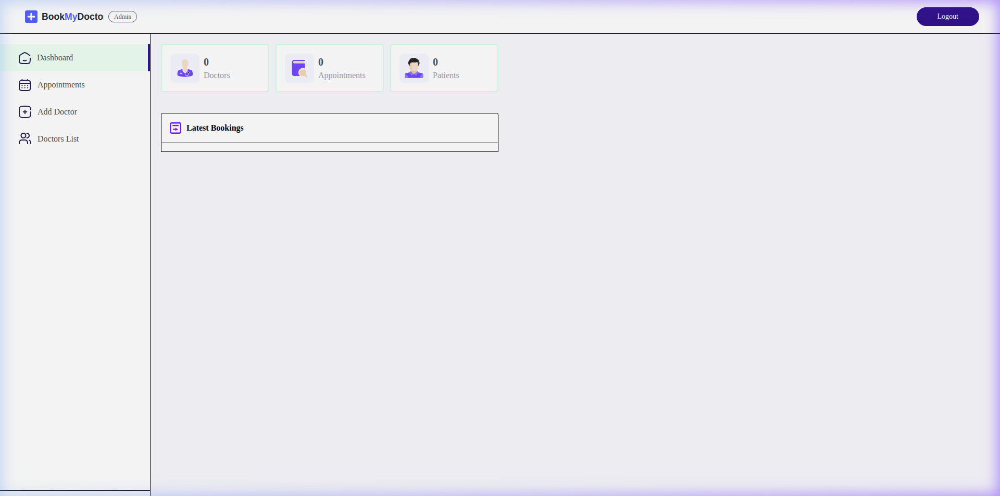

# ⚙️ BookMyDoctor – Admin Dashboard

The control center for BookMyDoctor. Empowering administrators to manage the medical network, oversee appointments, and monitor platform health.



## ✨ Key Capabilities

-  **👨‍⚕️ Doctor Management**: Add new doctors with multipart image uploads, view the full medical directory, and toggle availability.
-  **📅 Appointment Oversight**: Monitor all bookings across the platform and cancel them if necessary.
-  **📊 Live Analytics**: Real-time dashboard metrics tracking total doctors, patients, and appointments.
-  **🔒 Secure Access**: Dedicated admin authentication flow powered by JWT.
-  **🌍 Localized UI**: Full support for English and Amharic languages in the dashboard.

## 🛠️ Tech Stack

- **Framework:** React 18 + Vite
- **Styling:** Tailwind CSS
- **State Management:** React Context API (AdminContext)
- **Notifications:** React Toastify
- **Communication:** Axios

## 🚀 Development Setup

1. **Install Dependencies:**
   ```bash
   npm install
   ```

2. **Configure Environment:**
   Create an `.env` file in the `admin` directory:
   ```env
   VITE_BACKEND_URL=http://localhost:4000
   ```

3. **Start Dev Server:**
   ```bash
   npm run dev
   ```
   Visit [http://localhost:5174](http://localhost:5174)

## 📁 Internal Structure

- `src/pages/Admin/AddDoctor.jsx`: Specialized form for adding new medical professionals.
- `src/pages/Admin/Dashboard.jsx`: Visual summary of platform activity and recent bookings.
- `src/pages/Admin/DoctorsList.jsx`: Management interface for the doctor directory.

---

**Headers required:** `{ aToken: <admin-jwt> }`

## 🔧 Troubleshooting

- ❌ **Unauthorized**: Confirm `aToken` is present and backend `JWT_SECRET`, `ADMIN_EMAIL`, `ADMIN_PASSWORD` are set correctly
- 📸 **Image upload fails**: Ensure the form field is `image` and backend Cloudinary env vars are configured

